# A slate of various Clustering Methods
An assignment for CMPE 255 - Data Mining where various clustering methods will be used on a set of data.

Data is included in the data_samples folder.

Data for the art_table.zip data was sourced from the National Gallery of Arts 'OpenData' github repo and API.

Data for the ActorsSpeech_1-8.zip and the actors_meta_df.csv was sourced from the Kaggle RAVDESS emotional audio dataset.

Finally, data for the Simulated_Sales_TimeSeries dataset was also sourced from Kaggle.
> https://www.kaggle.com/datasets/maximsakhan/rc-superstore-grocery-data

## Images of the Clusters

**K-Means clustering on Audio/Emotion**

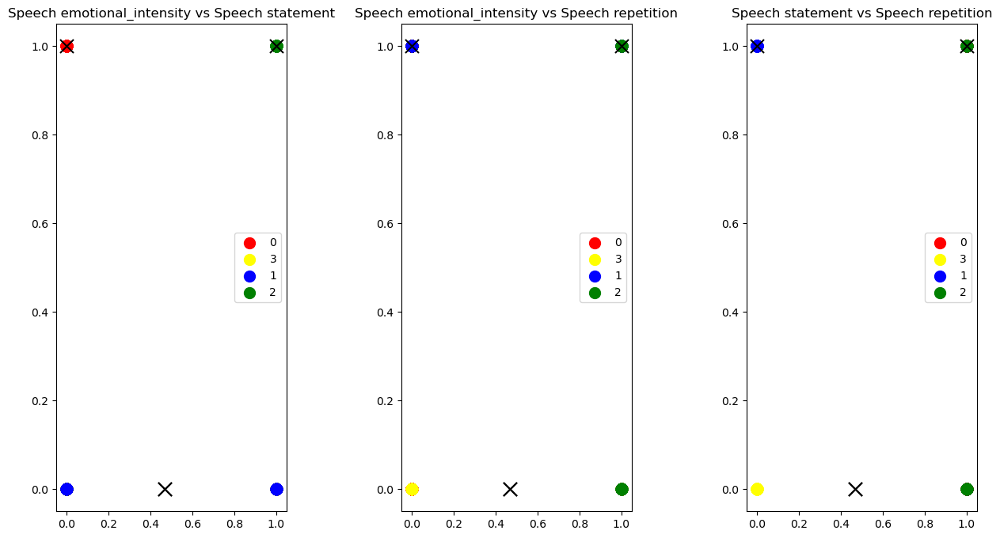

**Image Clustering of Audio Spectograms**

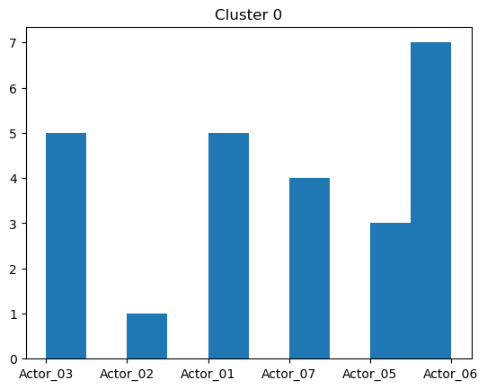

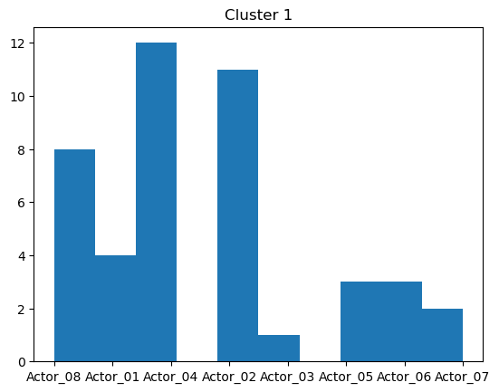

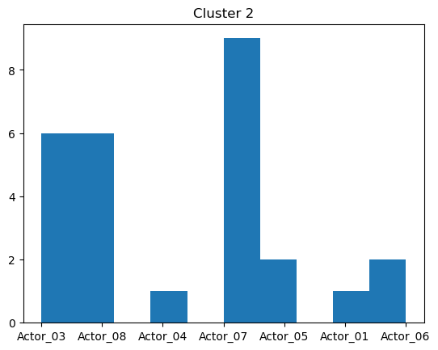

**Hierarchical clustering on Audio/Emotion**

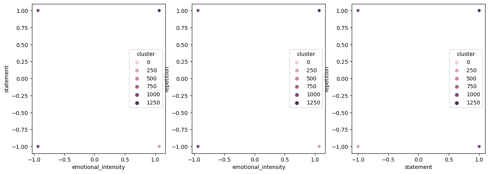

**Gaussian mixture models clustering (given init_means param for finding best cluster centers) on Audio/Emotion**

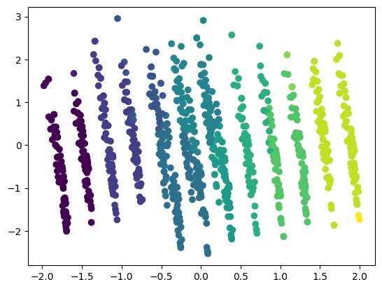

**DB Scan clustering (hyper-parameters found with grid search) using pycaret library on Audio/Emotion**

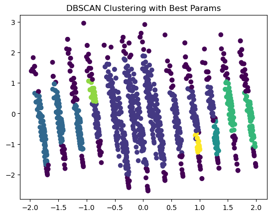

**Anomaly detection using pyOD using any usecase (eg: univariate or multivariate) on Numerical Sales**

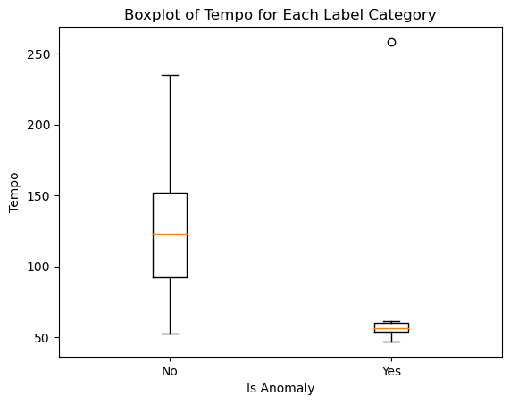

**Clustering of timeseries data using pretrained models on Numerical Sales**

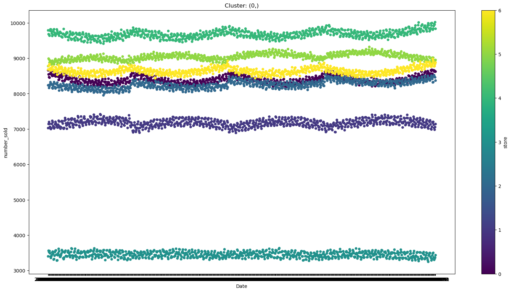

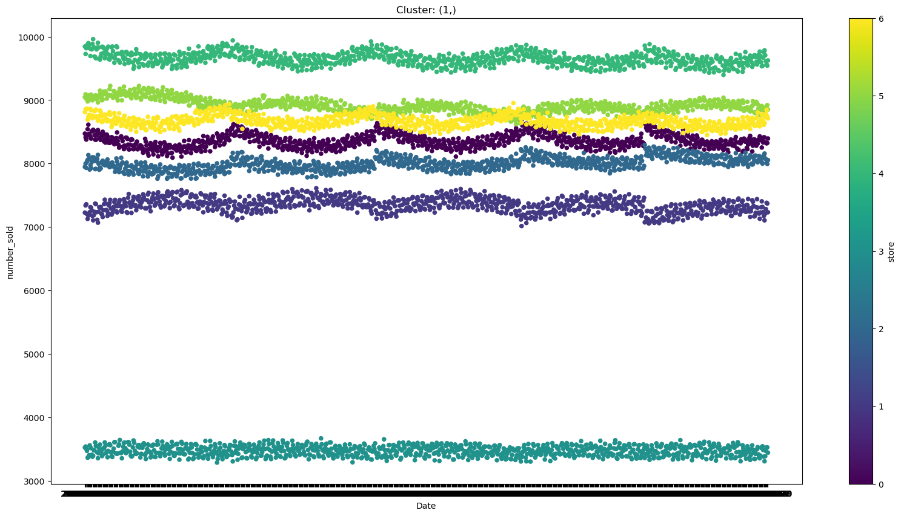

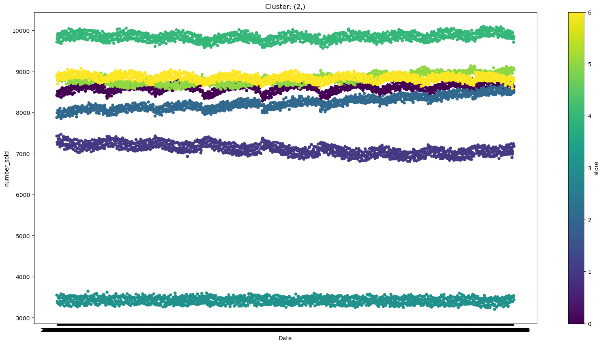

**Document / Text Clustering (LLM Embeddings)**

